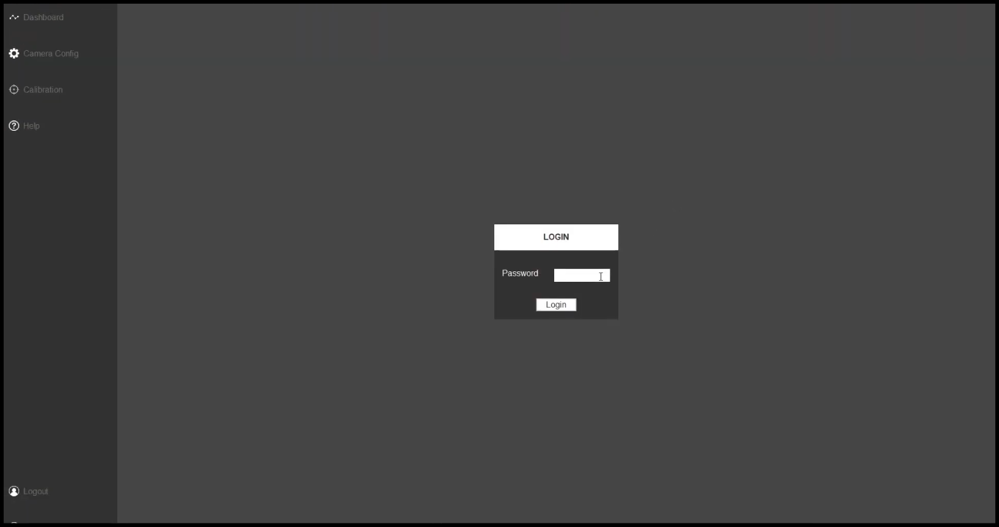
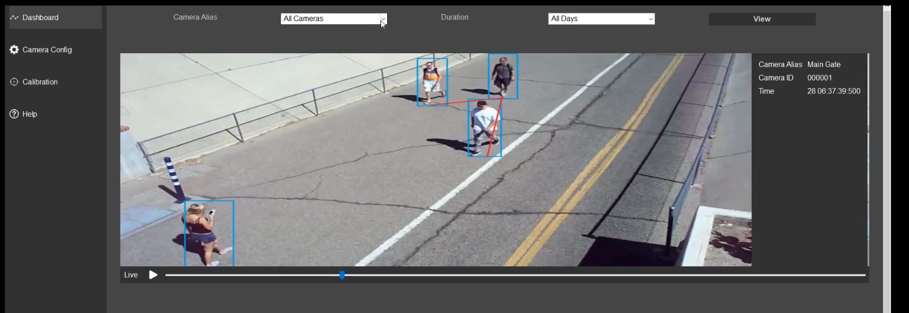
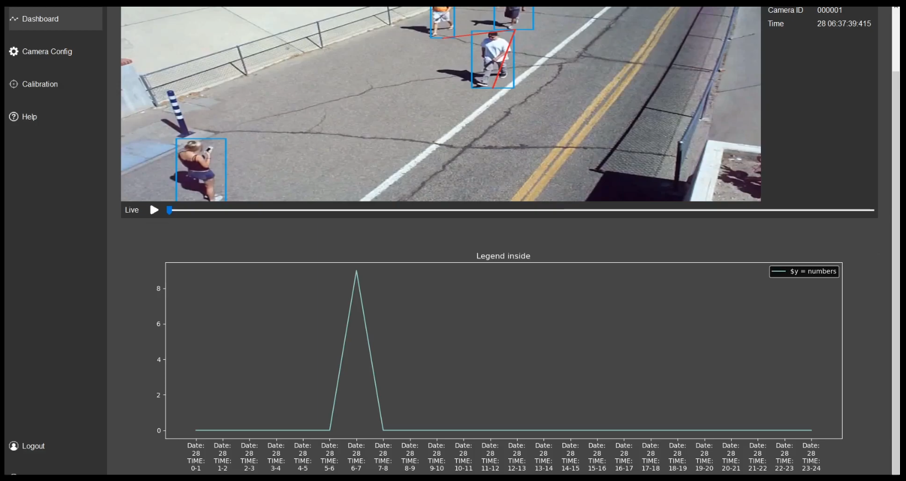
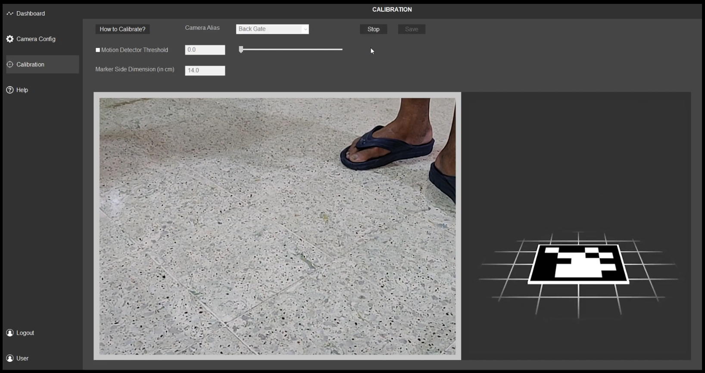
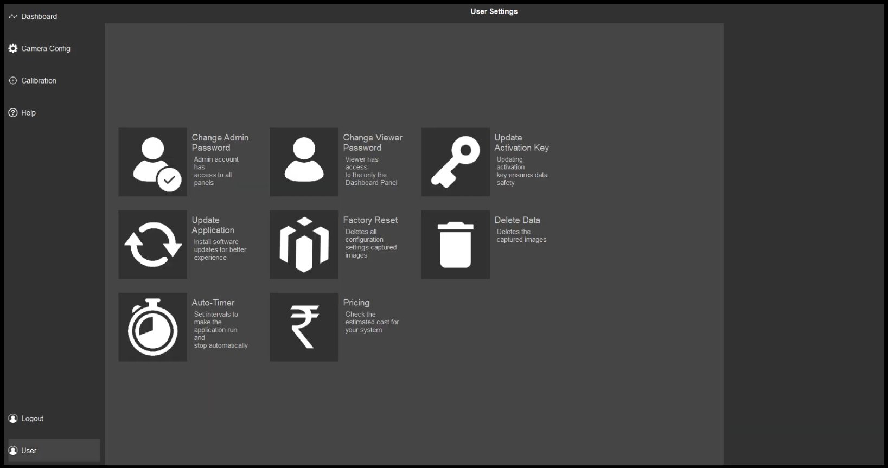

# Social Distancing Surveillance System
An AI-based social distancing surveillance system which uses multiprocessing to achieve real-time performance. 

## Dependencies
Entire dependencies list can be found in the requirements.txt
- WxPython
- Mxnet
- Gluoncv
- Opencv Contrib Modules
- Matplotlib

## Installation Instructions
- Run `SCRIPTS/MISC/make_file.py` to get the pre-trained models.
- Make a `FRAMES` folder if already not present.
- Run `pip install -r requirements.txt`
<br />
If their are some errors in installing wxPython directly using `requirements.txt` then try running `pip install wxwidgets`.


## Usage
Run `SCRIPTS/Main.py` to start the social distancing surveillance system.
```sh
$python SCRIPTS/Main.py
```

## GUI Elements
### Login Page


### Dashboard Page
#### Gallery / Live Feed

#### Plots for Analysis


### Camera Configuration Page


### Camera Calibration Page


### User Page



## Key Features
### Motion Detector
##### The Problem
If the persons in frame are not moving then the distance between them will remain approximately the same. So processing these frames will lead to wastage of computation. Motion Detector feature helps in minimizing this wastage of comutation.
##### Results


Motion Detector measures the deviation and starts the human detection pipeline only if the deviation is more than a certain threshold value.

### Auto Recalibration
##### The Problem
After installation, the camera might move and this will lead to wrong distance measurement. Auto recalibration feature automatically detects such movement and correct the estimated pose of the camera.
##### Results

Image is captured when the camera is moved. Green square shows the original location of aruco tag

Image is captured after auto recalibration has corrected the estimated position of marker. Green square shows the position estimated by auto recalibration.
